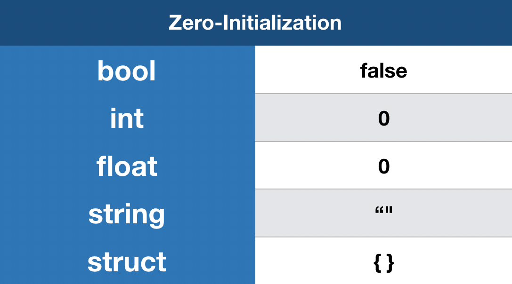

# Go Orientado a Objetos

Projeto desenvolvido para estudos da linguagem [Go](https://go.dev/doc/) utilizando o paradigma da orientação a objetos

## O que aprendemos

- #### Conceitos de Orientação a Objetos

Criamos um novo tipo de estrutura de dados para representar um objeto, chamado de struct. Essa estrutura de dados é composta por campos, que são variáveis que pertencem a um struct. Cada campo pode ser de um tipo diferente, e um struct pode ter vários campos.

Podemos instanciar esta nova classe utilizando atribuição curta. A sintaxe é a seguinte:

```go
var nomeDaInstancia NomeDaClasse
```

- #### Inicialização zero e **nil**

Mesmo não provendo nenhum valor, o Go garante inicializar todas as variáveis, conforme a imagem abaixo:



A inicialização zero é o valor padrão de um tipo de dado. Por exemplo, o valor zero de um inteiro é 0, o valor zero de um float é 0.0, o valor zero de um boolean é false, o valor zero de um string é "".

Porém, em muitas linguagens existe uma maneira de denotar um ponteiro nulo que, essencialmente, não aponta para nenhum lugar. Por exemplo: em C é **NULL**, em Python é **None** e em java é **null**. Em Go, temos o **nil**.

- #### Conceitos de ponteiros e referências 

Um ponteiro é um valor que armazena o endereço de memória de outra variável. Em Go, um ponteiro é representado pelo operador **&**. Por exemplo, se quisermos obter o endereço de memória de uma variável, podemos fazer: 

```go 
var x int = 1
p := &x
```

O operador **&** é chamado de operador de referência, pois ele retorna o endereço de memória de uma variável. 

O operador asterisco **\*** é chamado de operador de desreferência, pois ele retorna o valor armazenado no endereço de memória apontado por um ponteiro. Por exemplo, se quisermos obter o valor armazenado no endereço de memória de uma variável, podemos fazer: 

```go 
var x int = 1
p := &x
fmt.Println(*p) // 1
```

- #### Conceitos de encapsulamento

Em Go, não existe a palavra reservada **private** ou **public**. Porém, é possível simular o conceito de encapsulamento utilizando a convenção de que um campo de um struct começa com letra maiúscula se ele for público e com letra minúscula se ele for privado.

- #### Conceitos de Herança

Em Go, não existe a palavra reservada **extends**. Porém, é possível simular o conceito de herança utilizando a composição de structs. Por exemplo, se quisermos criar uma classe **Pessoa** e uma classe **Aluno** que herda de **Pessoa**, podemos fazer: 

```go
type Pessoa struct {
  nome string
}

type Aluno struct {
  Pessoa
}
```

- #### Conceitos de Polimorfismo
